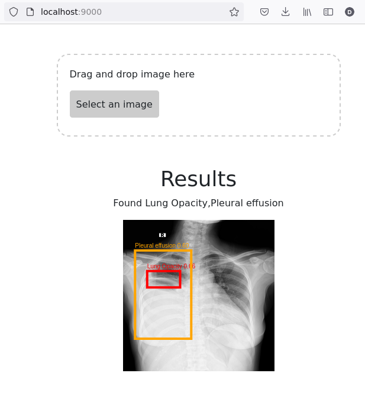

# Introduction
 I wanted to be able to showcase a deep learning model predictions' in a way that could be used easily by real world users. That is why I decided to use and learn at the same time Flask, JS in order to build a simple web app. This web app predicts common thoracic lung diseases and localizes critical findings from X-ray images from the kaggle  [dataset](https://www.kaggle.com/c/vinbigdata-chest-xray-abnormalities-detection/data). Visit kaggle in order to know more about the challenge. 

# Model
EfficientDet Pytorch implementation by this [repo](https://github.com/rwightman/efficientdet-pytorch). I have modified the code where needed to be able to train and infer on this custom dataset. 

# Web App
I am using Flask for this task, given its simplicity and easier to learn curve. Essentially, I just take an image uploaded by the user, and then use this image to predict the lung disease. 

Note: This app currently only supports 256 x 256 images and can only handle uploading single images. I am learning as I go, therefore the features would be added little by little. 

You can [download](https://drive.google.com/file/d/1IPquF34E0t5MOnkLqUrNzbDbrElAWs2F/view?usp=sharing) this image to test the sample output in the sample demo. 

# Demo usage

`python app.py`

Then,

`python -m http.server`

Open the page on the default port, and upload the image and should see the predictions, as below

# TODOs 
 - Upload pre-trained model checkpoint-16.pth 
 - Provide the user with ~5-6 demo images to try out the web app without having to download the entire dataset to test it. 
 - Handle input sizes different than 256 x 256
 - Handle multiple files
 - Deploy to Heroku